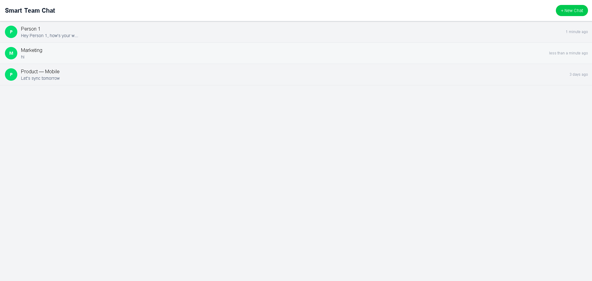
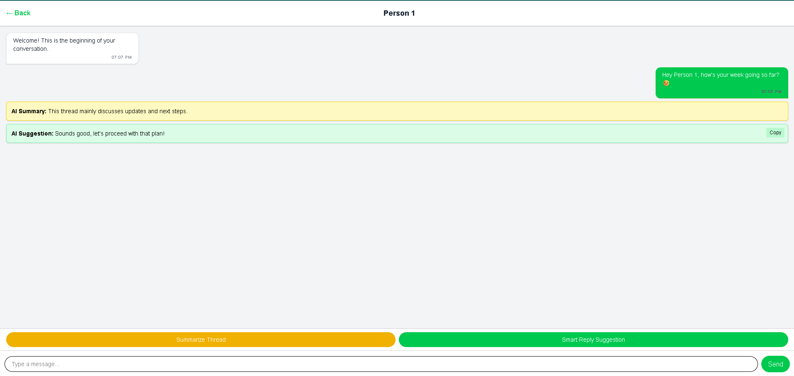
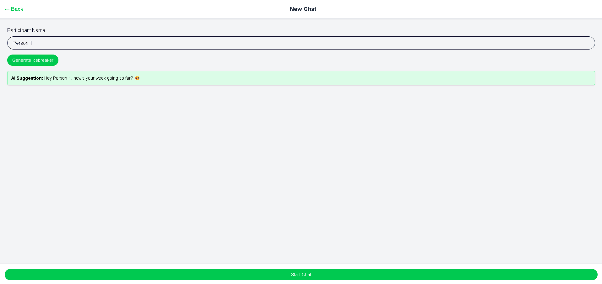

# Smart Team Chat (Prototype)

A minimal **AI-first team chat prototype** built with **React, React Router, and Tailwind CSS**.  
The goal is to demonstrate how AI can enhance team communication by providing **suggestions, summaries, and prompts**.

This is a **frontend-only prototype** (no backend integration).  
Focus: **UI/UX and AI placeholders**.

---

## Features

### 1. Chat List

- Displays a list of dummy chat conversations.
- Shows **name, last message, and timestamp**.
- Modern responsive UI inspired by **WhatsApp**.

### 2. Chat Window

- Conversation thread with dummy messages.
- AI-first placeholders:
  - **Summarize Thread** → shows a dummy summary.
  - **Smart Reply Suggestion** → shows a placeholder AI reply.
- Sticky input bar for sending messages (WhatsApp-like UX).

### 3. New Chat

- Start a new conversation by entering a participant’s name.
- AI button: **Generate Icebreaker** → creates a sample friendly message.
- Every new chat starts with a **predefined starter message** from the system.

---

## Tech Stack

- **React 18+**
- **React Router v6**
- **Tailwind CSS v4**
- **JavaScript (ES6+)**

---

## Project Structure

```
src/
│── components/
│ ├── AIControls.jsx
│ ├── ChatItem.jsx
│ ├── InputBar.jsx
│ ├── MessageBubble.jsx
│ └── MessageList.jsx
│
│── context/
│ └── ChatContext.jsx
│
│── pages/
│ ├── ChatList.jsx
│ ├── ChatWindow.jsx
│ └── NewChat.jsx
│
│── App.jsx
|── App.css
│── main.jsx
│── index.css

```

---

## UI/UX Highlights

- Fully **responsive design** (mobile-first).
- WhatsApp-inspired **colors and layout**:
  - Green buttons, white chat bubbles, gray background.
- **Sticky input bar & AI controls** for seamless UX.
- Global font: [Epunda Sans](https://fonts.googleapis.com/css2?family=Epunda+Sans:ital,wght@0,300..900;1,300..900&display=swap).

---

## Getting Started

### 1. Clone Repository

```
git clone https://github.com/your-username/smart-team-chat.git
cd smart-team-chat
```

### 2. Install Dependencies

```
npm install
```

### 3. Run Development Server

```
npm run dev
```

### 4. Build for Production

```
npm run build
```

### Future Enhancements

- Connect real AI backend (OpenAI, Anthropic, etc.) for true AI replies/summaries.

- Backend integration for real-time chat (WebSockets/Firebase).

- Progressive Web App (PWA) support for mobile-like experience.

- Dark mode toggle.

### Screenshots (Prototype UI)

(Add screenshots here after running the project)

- **Chat List**



- **Chat Window with AI placeholders**

  

- **New Chat with Icebreaker**

  

### Author

- J K Swaminathan  
  [GitHub](https://github.com/Swaminathanjk){:target="\_blank"} | [LinkedIn](https://www.linkedin.com/in/swamijk/){:target="\_blank"}
